# Conduct CS and AI Research

[](https://github.com/honghuy127/cs-ai-research-skills/actions/workflows/ci.yml)
[](https://www.python.org)
[](LICENSE)

An Agent Skills-compatible package for rigorous computer science and AI research, tested for OpenCode, Codex, and Claude Code. It guides an AI agent through idea construction, literature synthesis, novelty and feasibility checks, proposals, experimental design, implementation, evaluation, statistical analysis, reproducibility, paper writing, figure and diagram preparation, formatting checks, office document analysis and authoring, presentation slides, peer review, and rebuttals, with evidence discipline enforced at every step.

The skill follows the [Agent Skills specification](https://agentskills.io/specification): a lean `SKILL.md` router loads focused reference playbooks on demand, so an agent only reads the guidance relevant to the current task.



The figure's editable source is [figures/fig-001-skill-architecture.drawio](figures/fig-001-skill-architecture.drawio); regenerate the exports with `python3 scripts/render_drawio.py figures/fig-001-skill-architecture.drawio` after any edit.

## Design principles

- **Truth states, not vibes.** Every claim moves through an explicit lifecycle (`NOT_ASSESSED → PROPOSED → PLANNED → IMPLEMENTED → SMOKE_TESTED → PILOT_ONLY → EXECUTED → ANALYZED → VERIFIED → REPORTED`), and workflow maturity is tracked separately from the evidential verdict. A pipeline that runs is not a result; a pilot is not confirmatory evidence. Source-grounded work (reviews, surveys, conceptual exposition, static analysis) skips the execution states: its claims move `PROPOSED → VERIFIED → REPORTED` on traced sources, and no runs are required.
- **Evidence eligibility.** Smoke tests and synthetic plumbing output are structurally barred from becoming scientific evidence. A completed full measured run is only a candidate until it is independently verified.
- **Decisive gates.** Each phase ends with a gate returning `PASS`, `CONDITIONAL`, `FAIL`, `BLOCKED`, or `NOT_ASSESSED`, with evidence and the next decisive action.
- **No fabrication.** Unverifiable content becomes `[CITATION NEEDED]`, `[EVIDENCE NEEDED]`, or `[RESULT PENDING]`, never plausible filler. The audit script fails on unresolved markers in reported deliverables.
- **Humans keep authority.** Submissions, releases, costly runs, participant work, and license or authorship decisions stay with the user.
- **No silent skill choice.** When a host's own skill or built-in command covers the same task as this skill (Office files, PDFs, slides, figures, code review), the agent asks the user which to use, or whether to combine them, instead of choosing on its own. It asks even when the user invoked this skill by name, because invoking it for one request is not a choice against the host's skill; the answer holds for the current session only.
- **Two operating modes.** In `agent-led` mode the agent drives a phase or project and gates block. In `human-led` mode the researcher directs each step; the agent raises an advisory whenever a step would fail a gate, then follows the human's decision and records the override. The floor (no fabrication, no hidden overrides, no relabeled evidence, no unauthorized external action) holds in both.

## To Burn, or Not to Burn

*A soliloquy for evidence-grounded agents, after Shakespeare’s Hamlet.*

> To burn, or not to burn—that is the prompt:<br>
> Whether ’tis nobler in the mind to vibe,<br>
> And spend ten thousand tokens on a guess,<br>
> Or take up skills against a sea of claims<br>
> And, harnessed well, examine every one.
>
> To search, to cite—<br>
> To cite, perchance to know. Ay, there’s the rub:<br>
> For what hallucinations yet may come,<br>
> When agents roam beyond the evidence,<br>
> Must give us pause.
>
> A smoke test is no proof; a run, no truth,<br>
> Till claim and source and artifact agree.<br>
> Thus evidence makes cowards of our vibes,<br>
> And bold conjecture, lacking citation,<br>
> Becomes `[EVIDENCE NEEDED]`.
>
> Load not the world, but only what thou need’st;<br>
> Let skills give craft; let harness set their bounds.<br>
> Then burn thy tokens, if the gate be worth it:
>
> **PASS, CONDITIONAL, FAIL, or BLOCKED.**

## Repository layout

| Path | Contents |
|---|---|
| `SKILL.md` | Entry point and router; loads references per task intent |
| `references/` | Twenty-one reference playbooks: phase workflows (literature, design, evaluation, analysis, writing, manuscript revision, figures and diagrams, formatting, office documents, Markdown documents, presentation slides, GitHub collaboration, review, ethics) plus cross-cutting gate, contract-and-state, operating-mode, methodology-sources, and orchestration references |
| `scripts/` | Dossier tooling: `research_state.py`, `capture_run.py`, `audit_research.py`, plus the `validate_drawio.py` figure lint, the `render_drawio.py` headless drawio renderer, the `check_latex_log.py` build-log checker, the `check_office.py` Office package checker, and the `check_markdown.py` Markdown checker; `research_contract.py` holds the shared controlled vocabularies the tools import |
| `assets/` | Copy-and-adapt templates: research brief, experiment plan, paper and proposal outlines, figure plan, format checklist, slide deck plan, review template, rebuttal matrix |
| `agents/openai.yaml` | Interface metadata for runtimes that read the OpenAI agent format |
| `tests/` | End-to-end tests for the scripts |
| `requirements-dev.txt` | Pinned test and lint dependencies used locally and in CI |
| `tools/install_skill.py` | Safe dry-run-first installer for OpenCode, Codex, Claude Code, or a shared multi-agent setup |
| `hooks/` | Tracked Git hooks that run the offline checks before each commit and push; see Testing |

## Installation

The directory containing `SKILL.md` must be named `conduct-cs-ai-research`. The repository name is different, so either clone into that exact directory or use the installer below.

### Shared installation for OpenCode, Codex, and Claude Code

Clone the repository anywhere, then preview and apply a user-level installation:

```bash
git clone https://github.com/honghuy127/cs-ai-research-skills.git
cd cs-ai-research-skills
python3 tools/install_skill.py --scope user --agents all
python3 tools/install_skill.py --scope user --agents all --apply
```

The installer links one checkout into `~/.agents/skills/conduct-cs-ai-research` for Codex and OpenCode, and into `~/.claude/skills/conduct-cs-ai-research` for Claude Code. It never replaces an existing file or a link to another source. Re-running it for the same checkout is idempotent.

For a project-level installation, supply the target repository explicitly:

```bash
python3 tools/install_skill.py --scope project --project-dir /path/to/project --agents all
python3 tools/install_skill.py --scope project --project-dir /path/to/project --agents all --apply
```

This creates the shared `.agents/skills/` link plus the Claude-compatible `.claude/skills/` link inside that project. Commit those links only if the source checkout location is stable for every collaborator; for a team repository, a submodule or a copied release artifact is usually more reproducible than a machine-specific link.

### Agent-specific locations

| Agent | User scope | Project scope | Explicit use |
|---|---|---|---|
| [Codex](https://developers.openai.com/codex/skills/) | `~/.agents/skills/conduct-cs-ai-research` | `.agents/skills/conduct-cs-ai-research` | Select with `/skills` or mention `$conduct-cs-ai-research` |
| [OpenCode](https://opencode.ai/docs/skills) | `~/.agents/skills/conduct-cs-ai-research` (shared) | `.agents/skills/conduct-cs-ai-research` (shared) | Ask for the skill by name or select it from the available skills |
| [Claude Code](https://code.claude.com/docs/en/skills) | `~/.claude/skills/conduct-cs-ai-research` | `.claude/skills/conduct-cs-ai-research` | Invoke `/conduct-cs-ai-research` or let Claude match the description |

With `--agents opencode` alone, the installer uses OpenCode's native locations instead of the shared path: `~/.config/opencode/skills/conduct-cs-ai-research` (user scope) or `.opencode/skills/conduct-cs-ai-research` (project scope).

To install only one host, replace `--agents all` with `--agents codex`, `--agents opencode`, or `--agents claude`.

### Manual Claude Code installation

The installed directory name must match the skill name `conduct-cs-ai-research` (the repository name differs), so clone directly into the skills directory:

```bash
# Personal skill (all projects)
git clone https://github.com/honghuy127/cs-ai-research-skills.git ~/.claude/skills/conduct-cs-ai-research

# Project skill (one repository)
git clone https://github.com/honghuy127/cs-ai-research-skills.git .claude/skills/conduct-cs-ai-research
```

Claude Code then triggers the skill automatically for research-shaped tasks; users can also invoke it explicitly via `/conduct-cs-ai-research`.

### Other Agent Skills runtimes

Any runtime implementing the Agent Skills specification can load `SKILL.md` directly. Install the complete directory so relative `references/`, `scripts/`, and `assets/` remain available. `agents/openai.yaml` supplies optional display metadata for ChatGPT and Codex hosts that read that format.

## The project dossier

For substantial projects, the skill keeps canonical state in a `.research/` directory inside the research repository (never inside the installed skill):

```text
.research/
├── state.json          # index: stage, questions, deliverables, next actions
├── decisions.md        # append-only decision log
├── evidence.jsonl      # sources with verification depth and claim relations
├── claims.jsonl        # claims with lifecycle state and evidential status
├── experiments.jsonl   # run ledger
└── runs/<run-id>/manifest.json   # immutable per-run provenance
```

All scripts require only Python 3.10+ and the standard library, except `render_drawio.py`, which additionally needs `playwright` and a Playwright-installed browser (`python3 -m pip install playwright && python3 -m playwright install chromium`):

```bash
# Initialize a dossier in the current project
python3 scripts/research_state.py init --title "My Study" --owner "me"

# Update index fields; repeated list options replace the stored list
python3 scripts/research_state.py update --next-action "freeze design"

# Record the operating mode (agent-led or human-led)
python3 scripts/research_state.py update --operating-mode human-led

# Record a decision without a stage change, such as a human override of an advisory
python3 scripts/research_state.py decide --decision "keep the 3-seed design" \
  --reason "compute budget" --evidence "advisory: design gate would be CONDITIONAL" \
  --alternative "5 seeds" --consequence "wider intervals on CLM-002" --owner me \
  --revisit-condition "more compute"

# Record a justified stage transition
python3 scripts/research_state.py transition --stage design --status planned \
  --reason "design frozen" --evidence plan.md --alternative "stay in scoping" \
  --consequence "implementation may start" --owner me --revisit-condition "design change"

# Record provenance for a run that already happened (the script never executes commands)
python3 scripts/capture_run.py --run-id RUN-001 --experiment-id EXP-001 \
  --operator me --started-at 2026-08-14T01:00:00Z --ended-at 2026-08-14T01:30:00Z \
  --phase full --status completed --result-kind measured \
  --command "python train.py" --config cfg.yaml --output results/out.json

# Check structural traceability (exit 1 on any error)
python3 scripts/audit_research.py

# Lint draw.io figure sources (exit 1 on errors; --strict also fails on warnings;
# --min-font-size N sets the minimum label size; --json emits a machine report)
python3 scripts/validate_drawio.py figures/method.drawio

# Render a draw.io figure to PNG and SVG without the draw.io desktop CLI,
# via the diagrams.net static viewer in a headless Playwright browser
# (needs playwright; see the note above)
python3 scripts/render_drawio.py figures/method.drawio --scale 2

# Check a LaTeX build log for errors, overfull boxes, undefined refs
# (exit 1 on errors; --strict also fails on warnings; --json emits a
# machine report)
python3 scripts/check_latex_log.py build/main.log --max-pages 9

# Check Office packages (.docx, .pptx, .xlsx) for broken media, placeholder
# markers, and macro payloads (exit 1 on errors; --strict also fails on
# warnings; --json emits a machine report)
python3 scripts/check_office.py deck.pptx --strict

# Check Markdown files for unclosed fences, unresolved markers, broken
# relative links, and missing anchors (exit 1 on errors; --strict also
# fails on warnings; --json emits a machine report)
python3 scripts/check_markdown.py README.md docs/guide.md --strict
```

Notes on the audit:

- It certifies structure only, never novelty, statistics, ethics, or scientific validity.
- Records corrected via a `supersedes` field are excluded from auditing; only the head of each supersession chain is checked. A claim that still links superseded evidence gets a warning.
- Deliverables referenced by `reported` claims are automatically scanned for unresolved `[CITATION NEEDED]`, `[EVIDENCE NEEDED]`, and `[RESULT PENDING]` markers; pass additional files with `--scan`.
- Files over 64 MiB are not hashed and must carry an immutable external version (`--file-version PATH=ID` at capture time).
- The manifest's `capture_environment` records where it was written, not where the run executed; pass the run's own hardware and service facts via `--resource`.
- `research_state.py validate` and `status` inspect an existing dossier, `audit_research.py --json` emits a machine report, and every script documents its full flags under `--help`.

## Testing

```bash
python3 -m pip install -r requirements-dev.txt
ruff check scripts tools tests
python3 -m pytest tests/ -v
python3 scripts/check_markdown.py *.md references/*.md assets/*.md figures/*.md --strict
```

To catch problems offline before they reach CI, enable the tracked hooks once per checkout:

```bash
git config core.hooksPath hooks
```

The `pre-commit` hook lints when Python files are staged and checks staged Markdown; the `pre-push` hook runs the full suite above. Skip either with `git commit --no-verify` or `git push --no-verify`.

CI re-runs the same suite in a single job on the current feature series 3.14 and the minimum supported Python 3.10, so pushes that pass the hooks rarely fail. A separate weekly workflow checks external documentation links. Actions are pinned to immutable release commits, and Dependabot proposes controlled updates for both development dependencies and workflow actions.

## License

MIT. See [LICENSE](LICENSE).
